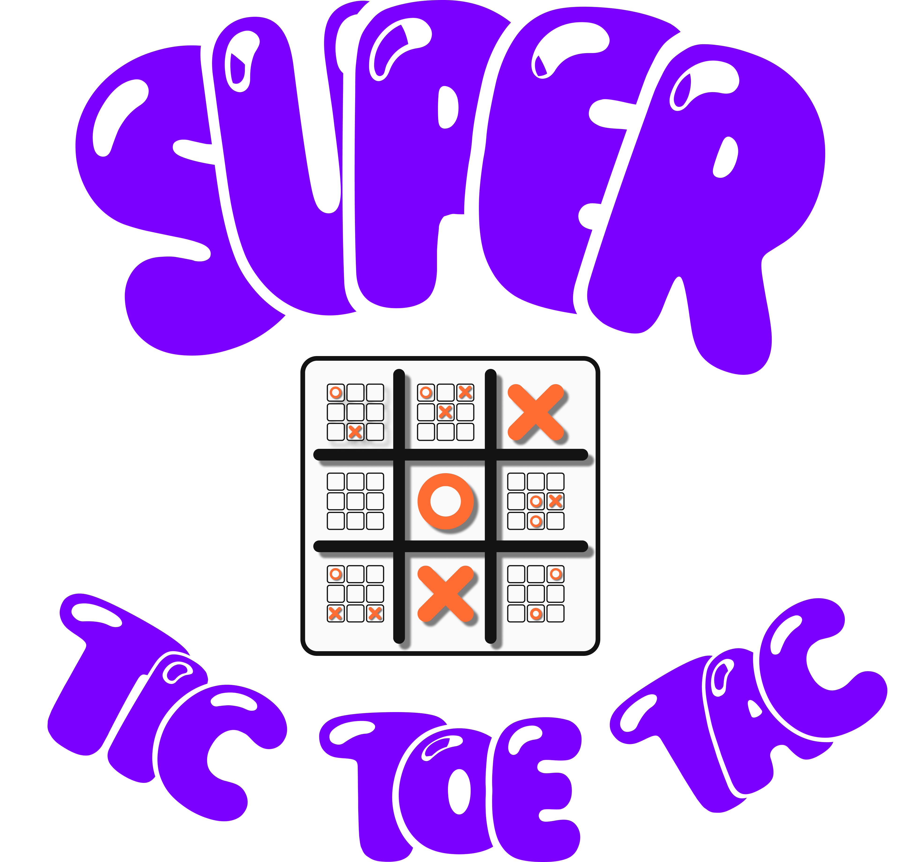

# Super Tic-Tac-Toe using React Native

Welcome to the Super Tic-Tac-Toe Game App, a delightful twist on the classic game. This app, developed using React Native, offers both offline and online gameplay for 2 players. Challenge your friends.

## Rules of the Game

- Make your first move in any of the 9 smaller grids.
- Your move sends your opponent to the corresponding smaller grid.
- Win a smaller grid by getting three symbols in a row.
- If a smaller grid is full or already won, choose any open grid for your next move.
- Win three smaller grids in a row to emerge victorious in the game.

## Features

- Engaging and strategic gameplay.
- Play offline against a friend.
- Challenge friends online for thrilling matches.
- Clear and intuitive user interface for easy navigation.

## Technologies Used

- **Frontend:** React Native
- **Backend:** [NodeJS](https://github.com/RajPatil002/TicTacToe-Server-using-NodeJs)

## Download and Play

To enjoy Super Tic-Tac-Toe, simply download and install the app from the [Github Release](https://github.com/RajPatil002/Super-TicTacToe/releases/tag/1.0).

Happy gaming!
